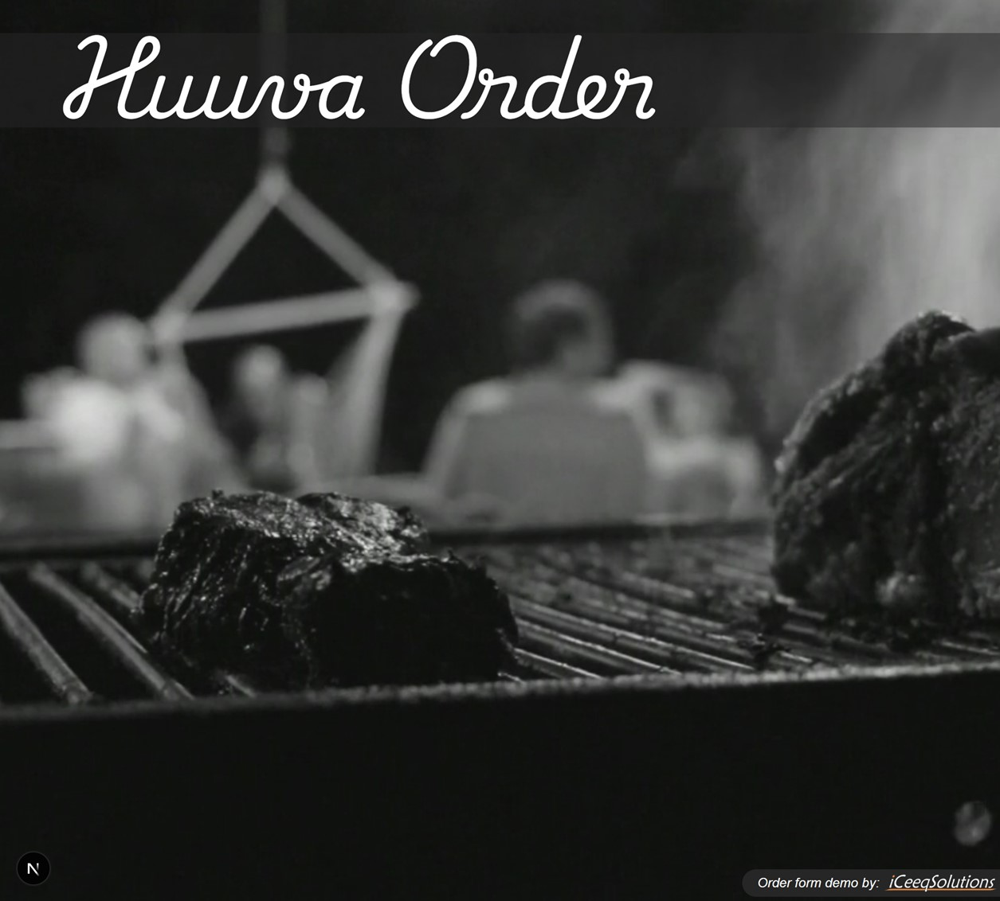
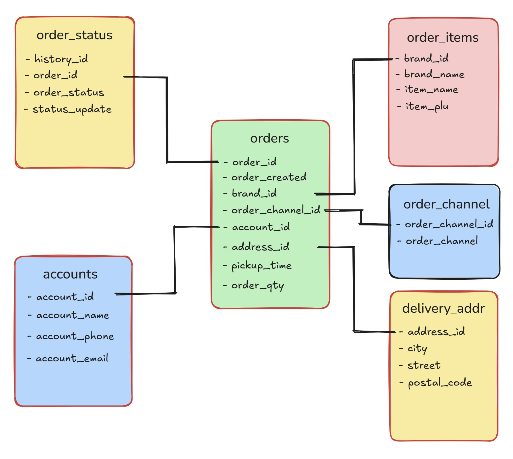
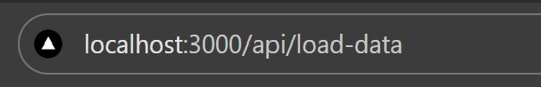
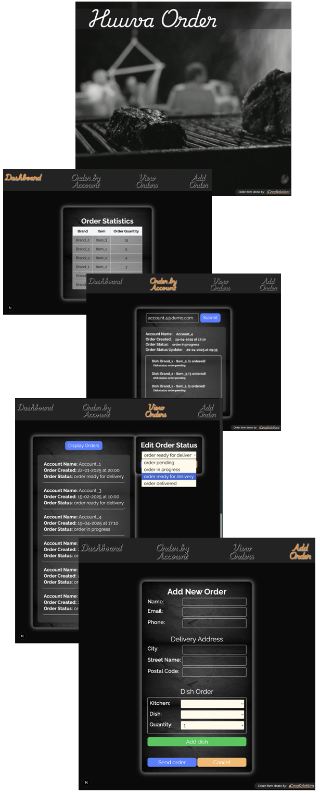

# Order Form Demo - Next.js/React/TypeScript/Tailwind

  Order Form Demo by <a href="https://iceeqsolutions.fi/" target="_blank">iCeeqSolutions</a>

## About

The Order Form demo is a brief introductory project on how to connect a PostgreSQL database to a Next.js based project.

To test out the demo, you can download the project and connect it to your own relational database.

Time spent on building the project: approximately 36-40 hours. Unfortunately a lot of extra time was spent on re-building the database structure, as the original structure proved impractical in the end.

Due to time constraints, some compromises were made towards the end - some of components are unnecessarily long and could benefit from splitting them into smaller pieces. The project as a whole contain a handful components that have been given their own pages. You can view them by clicking on the navlinks.

## Initial set up

You can load data into the project by using the included demo data in the lib -folder (demoData.ts). If you want to modify which tables are being loaded, go to the API in the app/api/load-data -folder and read the instructions on top.

Note that the SQL syntax might differ slightly from the one used in here (the Neon database), so change the queries according to the required syntax.

In order to load the available demo data, you need to type "localhost:3000/api/load-data" in your browser and hit enter:

## Page structure

The Dashboard page currently contain only a simple table that displays the amount of ordered dishes in descending order. This can naturally be expanded to include more insightful information about the orders.

In the Order by Account page, you can search all orders for a specific customer - you can e.g. test this out by using the "account.1@demo.com" from the available demo data.

The Orders page displays all current orders that have any other order status than "order delivered". Simply click the "Display Orders" -button to view the active orders. After that, you can click on any of the active orders in order to change the status for each order item.

Order Form Logic:
When you add an order to the database using the "Add New Order" -button, the order will get an initial status of 1 = Order Pending. Once the order status for any of the items change to "In progress", the status for the entire order will automatically change to order_status = 2 (i.e. Order in progress). After this, in order for the entire order's status to change to "Ready for delivery" (happens automatically), each of the items' statuses have to first have their status changed to "Ready for delivery".

## Built with

- Next.js
- TypeScript
- React
- Tailwind
- PostgreSQL - Neon
- Prettier
- ESLint

  

  
