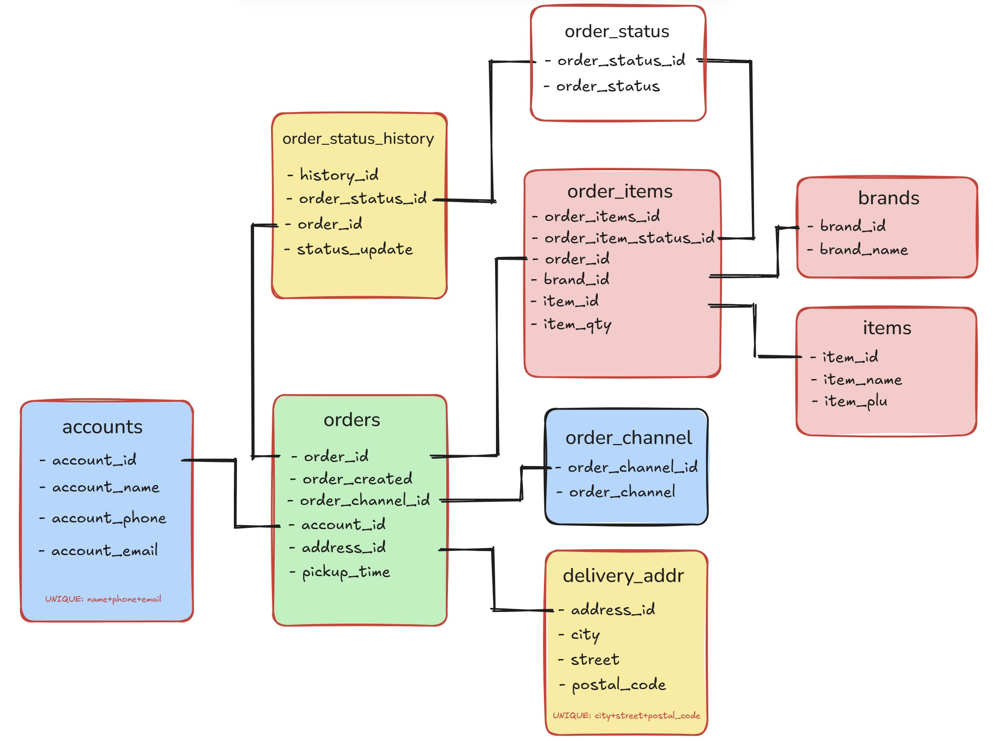

# Order Form Demo - Next.js/React/TypeScript/Tailwind

  Order Form Demo by <a href="https://iceeqsolutions.fi/" target="_blank">iCeeqSolutions</a>

## About

The Order Form demo is a brief introductory project on how to connect a PostgreSQL database to a Next.js based project.

To test out the demo, you can thus either use the link below, or download the project and connect it to your own relational database. Note that the SQL syntax might differ slightly from the one used in the Neon database, so change the queries according to the required syntax.

Time spent on building the project: approximately 36-40 hours. Unfortunately a lot of extra time was spent on re-building the database structure, as the original structure proved impractical in the end.

Due to time constraints, some compromises were made towards the end - some of components are unnecessarily long and could benefit from splitting them into smaller pieces. The project as a whole contain a handful components that have been given their own pages. You can view them by clicking on the navlinks.

## Initial set up

In order to load the available demo data, you need to type "localhost:3000/api/load-data" in your browser and hit enter:

## Page structure

The Dashboard page currently contain only a simple table that displays the amount of ordered dishes in descending order. This can naturally be expanded to include more insightful information about the orders.

In the Order by Account page, you can search all orders for a specific customer - you can e.g. test this out by using the "account.1@demo.com" from the available demo data.

The View Orders page displays all current orders that have any other order status than "order delivered". Simply click the "Display Orders" -button to view the active orders. After that, you can click on any of the active orders in order to change its status.

Via the final nav link, Add Order, you can add new orders with multiple kitchen/dish combinations (where Kitchen = brand and Dish = item).

## Demo

👁️ [Live Demo](https://huuva-order-form-demo.vercel.app/)

## Built with

- Next.js
- TypeScript
- React
- Tailwind
- PostgreSQL - Neon
- Prettier
- ESLint

  

  
